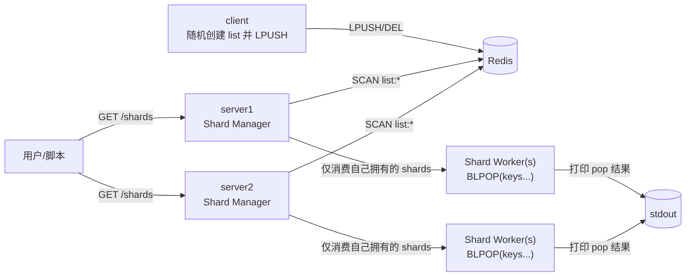

# test-redis-list-shards

本项目用于在本地快速启动一个 Redis（Docker）并验证：

- Redis 内存在很多 List key（默认 `list:*`）
- 程序会将这些 lists 分配到若干 Shard
- 每个 Shard 用独立 goroutine 对其负责的 lists 执行 `BLPOP` 并打印
- 当 Redis 中 lists 动态增减时，Shard 数量会自动扩缩容
- 提供 HTTP 接口查询当前所有 Shard 的信息

## 架构



多实例一致性说明：

- 每个 server 实例会把自己的 `INSTANCE_ID` 心跳写入 Redis 的成员表（ZSET，默认 `test-redis-list-shards:members`）。
- 所有实例用同一份 members 列表 + Rendezvous Hash 为每个 shard 选择 owner。
- 只有 owner 实例会启动该 shard 的 worker；因此多实例下不会出现“同一 shard 被多实例同时消费”的情况。
- 建议在多实例模式设置固定 `SHARD_COUNT`（例如 32/64），保证 shard ID 稳定；`SHARD_COUNT=0` 才会按 `LISTS_PER_SHARD` 动态计算 shard 数量。

## 快速开始

要求：已安装 `docker`、`docker compose`、`go`。

1. 启动 Redis + server

```bash
bash ./scripts/deploy.sh
```

2. 查看 Shard 状态

```bash
curl -s http://localhost:8080/shards | head
curl -s http://localhost:8081/shards | head
```

## 本地运行（不使用容器运行 server）

```bash
# 仅启动 Redis
docker compose up -d redis

# 运行 server
export REDIS_ADDRS=127.0.0.1:6380
go run ./cmd/server

# 另开一个终端运行 client
export REDIS_ADDRS=127.0.0.1:6380
go run ./cmd/client
```

## 接口

- `GET /healthz`：健康检查
- `GET /shards`：返回 JSON，包括 shard 数量、每个 shard 的 list 数量与列表

## 测试

```bash
bash ./scripts/test.sh
```

该脚本会：

- `docker compose up -d redis`
- 等待 Redis 就绪
- 执行 `go test ./...`

## 备注

- 默认假设 `list:*` 下的 key 都是 List 类型（测试环境通常成立）。如需更严格过滤，可在扫描后对每个 key 执行 `TYPE` 校验。
