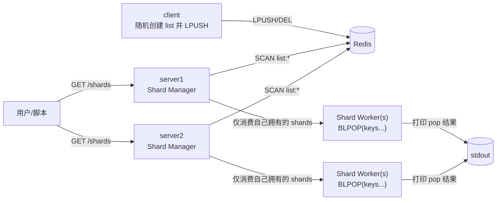
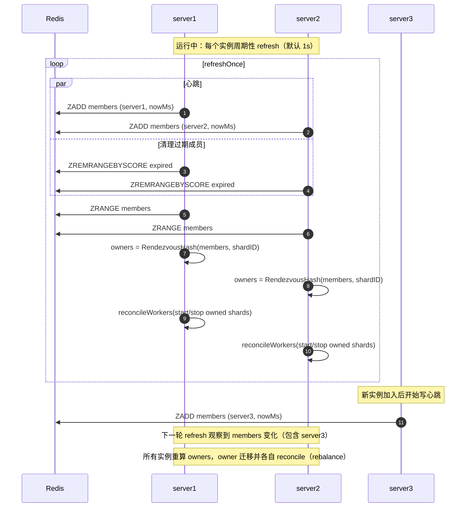

# test-redis-list-shards

本项目用于在本地快速启动一个 Redis（Docker）并验证：

- Redis 内存在很多 List key（默认 `list:*`）
- 程序会将这些 lists 分配到若干 Shard
- 每个 Shard 用独立 goroutine 对其负责的 lists 执行 `BLPOP` 并打印
- 当 Redis 中 lists 动态增减时，Shard 数量会自动扩缩容
- 提供 HTTP 接口查询当前所有 Shard 的信息

## 架构



多实例一致性说明：

- 每个 server 实例会把自己的 `INSTANCE_ID` 心跳写入 Redis 的成员表（ZSET，默认 `test-redis-list-shards:members`）。
- 所有实例用同一份 members 列表 + Rendezvous Hash 为每个 shard 选择 owner。
- 只有 owner 实例会启动该 shard 的 worker；因此多实例下不会出现“同一 shard 被多实例同时消费”的情况。
- 建议在多实例模式设置固定 `SHARD_COUNT`（例如 32/64），保证 shard ID 稳定；`SHARD_COUNT=0` 才会按 `LISTS_PER_SHARD` 动态计算 shard 数量。

## 无中心再平衡（Rebalance）如何工作

本项目的“无中心”指的是：没有 leader/调度器去下发“你负责哪些 shard”的指令。
每个实例都独立执行同一套确定性计算，然后用 reconcile 的方式让本机 worker 状态收敛到期望状态。

关键机制：

- **共享事实只有 members**：所有实例把自己的 `INSTANCE_ID` 写入 Redis ZSET（心跳），并读取同一个 members 列表。
- **owner 选择是纯函数**：给定相同的 `members` 和固定 shard ID 集合 `[0..SHARD_COUNT)`，所有实例都会算出相同的 `owner[shardID]`。
- **本机只做 reconcile**：每个实例只启动 `owner == INSTANCE_ID` 的 shard worker，并停止不再归自己拥有的 worker。
- **消费平滑切换**：worker 的 `BLPOP` 使用短超时，便于及时响应 stop/keys 更新；owner 变更后新旧实例很快完成交接。

### 将“沉默时间”压到 ~1s

默认 `MEMBER_TTL` 采用秒级（例如 6s）以减少误判；如果你希望实例消失后在 ~1s 量级接管，推荐启用 **per-shard lease（租约）** + **standby worker**：

- `LEASE_ENABLED=1`：启用 shard 租约，只有持有租约的实例才会真正 `BLPOP`。
- `STANDBY_DEPTH=2`：每个 shard 允许 top-2 候选实例都运行 worker（1 个 active + 1 个 hot-standby）。
- `LEASE_TTL=1s`，`LEASE_RENEW_EVERY=300ms`：租约过期即可被 standby 迅速抢占，从而无需等待 `MEMBER_TTL`。

示例（多实例容器环境变量）：

```bash
export SHARD_COUNT=32
export LEASE_ENABLED=1
export STANDBY_DEPTH=2
export LEASE_TTL=1s
export LEASE_RENEW_EVERY=300ms
```

权衡：standbyDepth 越大，实例数越多，总的 worker goroutine 数越多（例如 32 shards _ 2 depth _ N 实例上限），但换来更短的 failover。

下面的时序图展示了“成员变化 → owner 重算 → 本机启停 worker → 自动再平衡”的过程：



## 快速开始

要求：已安装 `docker`、`docker compose`、`go`。

1. 启动 Redis + server

```bash
bash ./scripts/deploy.sh
```

2. 查看 Shard 状态

```bash
curl -s http://localhost:8080/shards | head
curl -s http://localhost:8081/shards | head
```

## 本地运行（不使用容器运行 server）

```bash
# 仅启动 Redis
docker compose up -d redis

# 运行 server
export REDIS_ADDRS=127.0.0.1:6380
go run ./cmd/server

# 另开一个终端运行 client
export REDIS_ADDRS=127.0.0.1:6380
go run ./cmd/client
```

## 接口

- `GET /healthz`：健康检查
- `GET /shards`：返回 JSON，包括 shard 数量、每个 shard 的 list 数量与列表

## 测试

```bash
bash ./scripts/test.sh
```

该脚本会：

- `docker compose up -d redis`
- 等待 Redis 就绪
- 执行 `go test ./...`

## 备注

- 默认假设 `list:*` 下的 key 都是 List 类型（测试环境通常成立）。如需更严格过滤，可在扫描后对每个 key 执行 `TYPE` 校验。
